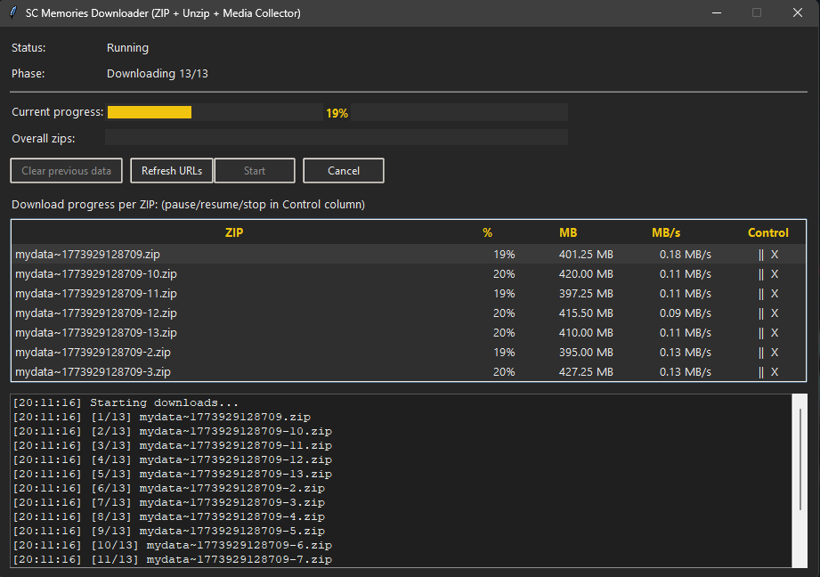
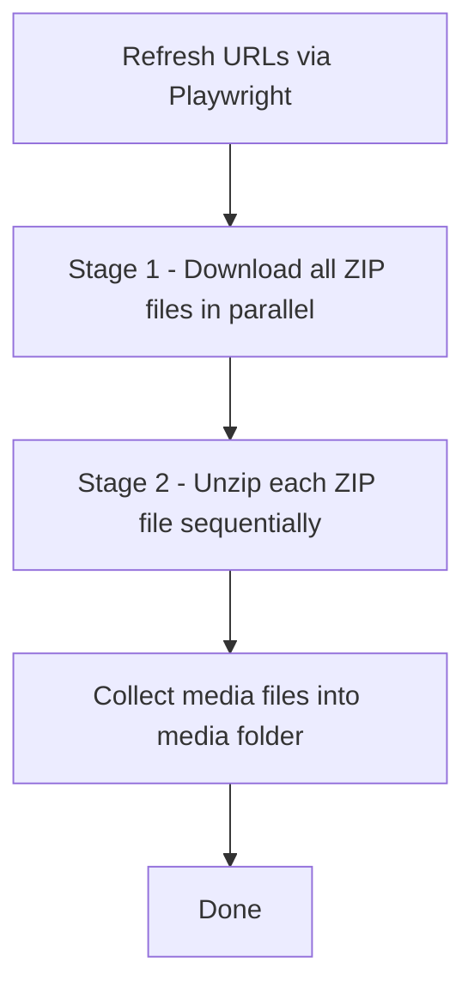
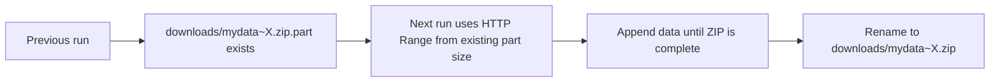
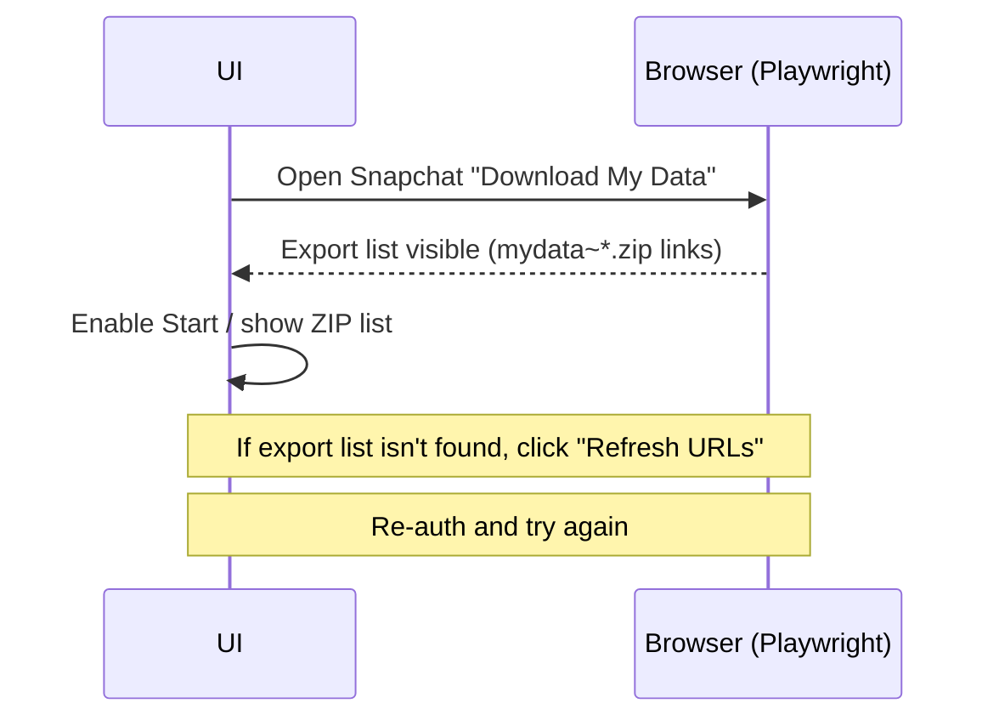

# SC Memories Downloader

Downloader for Snapchat “Download My Data” exports:
downloads the signed ZIPs, extracts them, and copies media files to a single `media/` folder.

## App screenshot



## What’s included

- Dark “SC-style” UI (gray + yellow)
- Per-ZIP progress:
  - `%` completed
  - `MB` downloaded
  - `MB/s` download rate
- Per-ZIP controls (in the `Control` column):
  - click left half: pause / resume (`||` / `>`)
  - click right half: stop that ZIP only (`X`)
- Resume interrupted downloads across runs:
  - partial files are saved as `downloads/*.zip.part`
  - resume uses HTTP `Range` and appends from the existing partial size
  - resume is keyed by the ZIP filename, so it still works if the *signed* URL changes after refresh
- URL refresh:
  - the app refreshes export URLs by default (requires Playwright login)
  - there is a `Refresh URLs` button in the UI for re-login / re-auth if needed
- Output folders created next to the app EXE (PyInstaller onefile):
  - `downloads/`, `extracted/`, `media/`
  - (when running as `.py`, folders are created next to `Downloader.py`)

## Requirements

- Python 3.x
- Playwright (only needed if you want the app to refresh URLs automatically)
- PyInstaller (only needed to build the Windows EXE)

Install dependencies:

```powershell
pip install playwright
python -m playwright install chromium
```

## Run

Refresh URLs (default behavior):

```powershell
python .\Downloader.py
```

If you already have `urls.txt` and want to skip the browser scraping step:

```powershell
python .\Downloader.py --skip-fetch-urls --urls-file .\urls.txt
```

### Optional flags

- `--skip-fetch-urls`: do not scrape export URLs
- `--urls-file`: path to `urls.txt` (default: `urls.txt` next to the script)
- `--min-urls`: minimum number of ZIP links to wait for when scraping
- `--timeout-sec`: scraping timeout in seconds
- `--write-urls-file`: save scraped URLs into `urls.txt`
  - note: this contains signed export links, so keeping it is optional

## Output folders

- `downloads/`: ZIP downloads (and `*.part` while downloading)
- `extracted/`: extracted ZIP contents
- `media/`: copied media files (images/videos) collected from the extracted data

## Diagrams

### Download pipeline



### Resume behavior



### Auth / re-login



## Privacy

The project does not embed signed ZIP URLs in code.
Signed URLs are normally fetched at runtime and are not stored in `urls.txt` unless you use `--write-urls-file`.

## Building a Windows EXE

```powershell
.\build_windows_exe.ps1 -Clean
```

The script installs requirements, ensures Chromium is installed for Playwright, then runs PyInstaller and writes the EXE to `dist/`.


